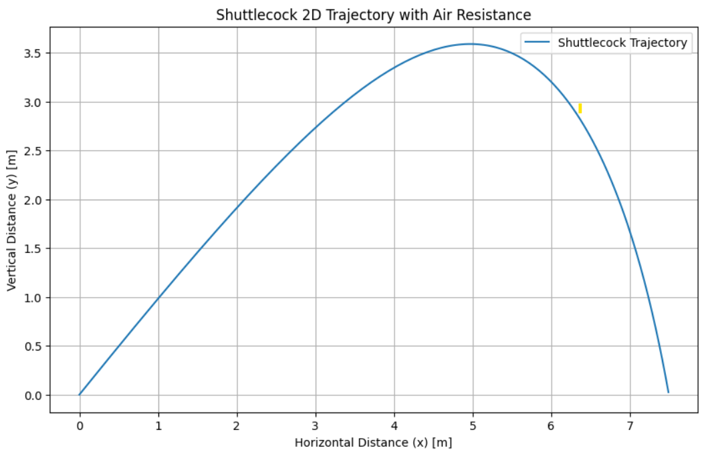

# Predicting Shuttlecock Trajectory with Physics-Informed Neural Networks (PINN)
This repository implements a Physics-Informed Neural Network (PINN) to model and predict the trajectory of a shuttlecock in 2D space. The project highlights the strengths of integrating physical laws into deep learning models, enabling precise predictions even with limited data.

The model is designed to:
1. Predict shuttlecock trajectories based on physical principles (e.g., gravity, drag).
2. Evaluate the benefits of training on sparse data (e.g., 20 representative points) while maintaining high accuracy.

---
## Project Overview
### Objectives :
- Comprehensive Modeling: Develop a PINN to predict a shuttlecock's trajectory using a combination of physical equations and neural network training.
- Data Efficiency: Demonstrate the advantage of PINNs by training with sparse data (20 points) compared to training on the full dataset.
- Robust Prediction: Mitigate the effects of noise in trajectory data through physics-based constraints.

---
## Dataset Generation

The dataset simulates the 2D motion of a shuttlecock under the influence of gravity and drag. 

### Simulation Parameters:
- **Gravity (g)**: 9.81 m/s²
- **Drag Coefficient (C_d)**: 0.5
- **Cross-sectional Area (A)**: 0.01 m²
- **Mass (m)**: 0.02 kg
- **Initial Velocity (v₀)**: User-defined (e.g., 30 m/s)
- **Launch Angle (θ)**: User-defined (e.g., 45°)

A differential equation governs the shuttlecock's motion:
- **Horizontal Acceleration**:$a_x = -C_d \cdot v \cdot v_x$ 
- **Vertical Acceleration**: $a_y = -g - C_d \cdot v \cdot v_y$
  Where:  
- $v = \sqrt{v_x^2 + v_y^2}$ is the velocity magnitude  

**Generated Data**: The simulation records $(x, y, v_x, v_y)$ for every time step $t$ by solving these equations iteratively. The shuttlecock's motion stops when its vertical position $y$ becomes negative.

---
## Architecture Design

The PINN architecture combines:
1. **Data-Driven Learning**: A neural network approximates the trajectory of the shuttlecock.
2. **Physics-Informed Constraints**: Physical equations serve as regularization terms, ensuring predictions comply with Newtonian mechanics.
   
### Model Components
- **Input**: Time ($t$)
- **Output**:  $[x, y, v_x, v_y]$
- **Structure**:
  - 3 fully connected hidden layers with 256 neurons each
  - Activation: Tanh function
  - Output: 4 neurons representing the trajectory state

#### Loss Function
1. **Data Loss**:
   Measures the difference between predicted ($\hat{y}$) and actual ($y$) trajectory points:
   $$
   \text{Data Loss} = \frac{1}{N} \sum_{i=1}^N \|\hat{y}_i - y_i\|^2
   $$

2. **Physics Loss**:
   Ensures compliance with Newtonian mechanics:
   $$
   \text{Physics Loss} = \| a_x - f_x \|^2 + \| a_y - f_y \|^2
   $$
   where:
   - $a_x, a_y$: Predicted accelerations (second derivatives computed via autograd).
   - $f_x, f_y$: Forces acting on the shuttlecock:
     $$
     f_x = -C_d \cdot v \cdot v_x, \quad f_y = -g - C_d \cdot v \cdot v_y
     $$
   - $C_d$: Drag coefficient, $g$: Gravity, $v$: Speed magnitude.

3. **Total Loss**:
   Combines data and physics losses with a regularization term ($\lambda_\text{reg}$):
   $$
   \text{Total Loss} = \text{Data Loss} + \lambda_\text{reg} \cdot \text{Physics Loss}
   $$

### Integration of Physical Loss
- **Design Rationale**:
  - The physical loss enforces compliance with real-world dynamics, reducing overfitting to noisy or limited data.
  - The inclusion of physical laws ensures the model generalizes well, even when trained on a sparse subset of data points.
- **Noise Mitigation**:
  - By regularizing predictions with physical equations, the model ensures smooth and realistic trajectories.
